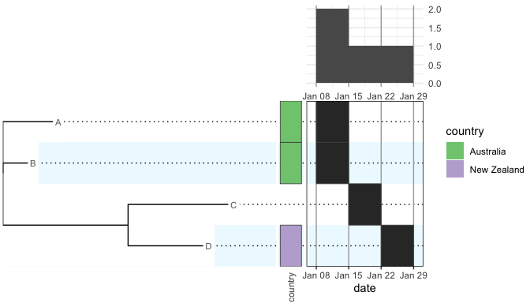

<!-- README.md is generated from README.Rmd. Please edit that file -->

# phylepic

<!-- badges: start -->
<!-- badges: end -->

Phylepic contains tools for visualisations that are useful for genomic
epidemiology of pathogens, designed for a public health setting.

## Installation

You can install phylepic like so:

``` r
# development version
devtools::install_github("cidm-ph/phylepic")
install.packages('phylepic', repos = c('https://cidmp-ph.r-universe.dev', 'https://cloud.r-project.org'))
```

## Example

This is an example of a very minimal phylepic chart. Refer to the
package vignette for a more complete example.

``` r
library(ape)
library(phylepic)

tree <- read.tree(text = "((D:0.3,C:0.4):0.5,B:0.1,A:0.2);")
metadata <- data.frame(
  ID = c("A", "B", "C", "D"),
  date = as.Date(c("2024-01-10", "2024-01-12", "2024-01-21", "2024-01-23")),
  country = factor(c("Australia", "Australia", NA, "New Zealand"))
)

phylepic(tree, metadata, ID, date) |> plot()
```


